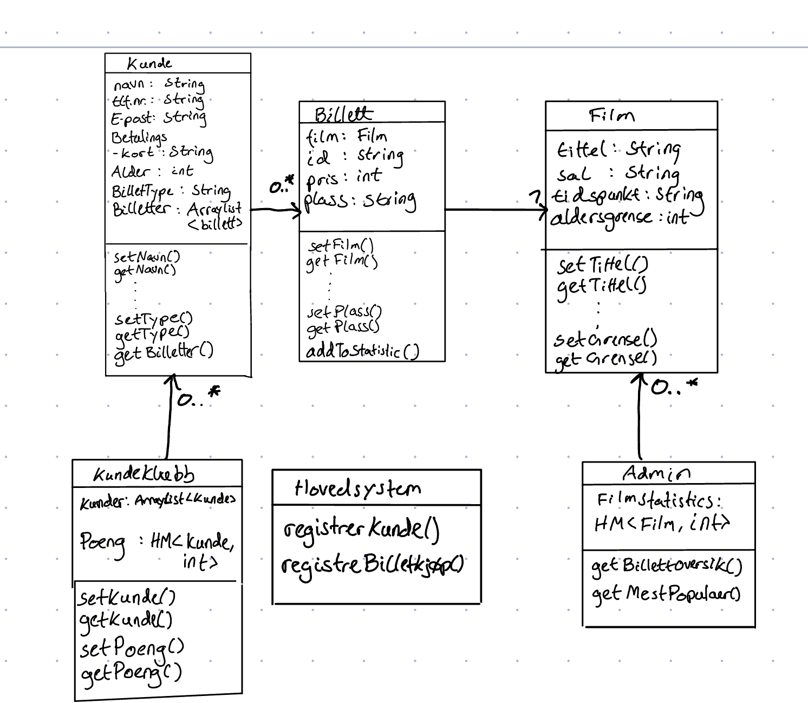

# IN1030 Oblig 5: Modellering av krav

**Daniel Schneider, Eskil Grinaker Hansen, Oscar Atle Brovold og Fredrik Foss-Indrehus**

## Oppgave 0 - Use case for billettsystemet

### A

### B

**Navn:** Bestill billett\
**Primæraktør:** Kunde\
**Sekundæraktør:** Kundesørvise
**Prebetingelse:** Ingen\
**Postbetingelse:** Billett med QR-kode

**Hovedflyt:**

1. Kunde velger film
2. System viser tilgjengelige tidspunkter
3. KUnde velger tidspunkt
4. System presenterer seter
5. Kunde velger sete
6. System oppretter betalingsmulighet
7. Kunde betaler
8. System returnerer billett

**Alternativ flyt punkt:**

2.1. Kunde finner ikke passende tidspunkt
2.2. Kunde kontakter kundesørvice
2.3. Kundeservice foreslår nytt tidspunkt
2.4. System sender kunde til setevalgmeny for nytt tidspunkt

**Alt 2:**

7.1. Betalingssystem streiker
7.2. Kunde kontakter kundeservice
7.3. Kundeservice tilbyr å booke for kunde og sende faktura

## Oppgave 1 - Klassediagram

