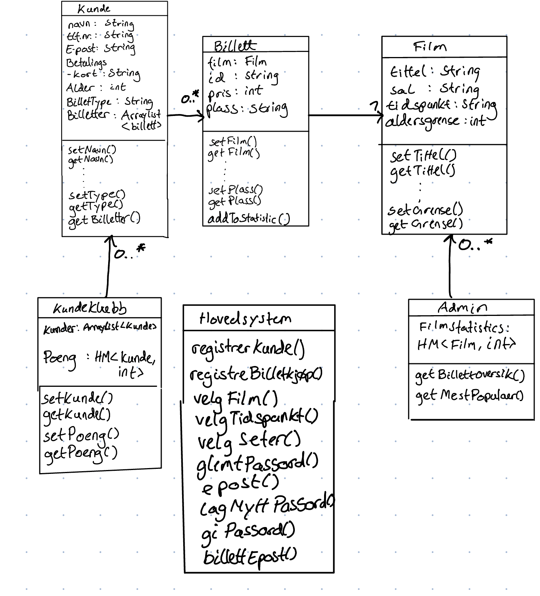

# IN1030 Oblig 5: Modellering av krav

**Daniel Schneider, Eskil Grinaker Hansen, Oscar Atle Brovold og Fredrik Foss-Indrehus**

## Oppgave 0 - Use case for billettsystemet

### A

### B

Navn: Bestill billett\
Primæraktør: Kunde\
Sekundæraktør: Kundesørvise
Prebetingelse: Ingen\
Postbetingelse: Billett med QR-kode

Hovedflyt:

1. Kunde velger film
2. System viser tilgjengelige tidspunkter
3. KUnde velger tidspunkt
4. System presenterer seter
5. Kunde velger sete
6. System oppretter betalingsmulighet
7. Kunde betaler
8. System returnerer billett

Alternativ flyt:

2.1. Kunde finner ikke passende tidspunkt\
2.2. Kunde kontakter kundesørvice\
2.3. Kundeservice foreslår nytt tidspunkt\
2.4. System sender kunde til setevalgmeny for nytt tidspunkt

Alternativ flyt 2:

7.1. Betalingssystem streiker\
7.2. Kunde kontakter kundeservice\
7.3. Kundeservice tilbyr å booke for kunde og sende faktura

## Oppgave 1 - Klassediagram

## Oppgave 2 - Sekvensdiagram

### A

Tekstlig beskrivelse for brukstilfellet “Kjøp billett som eksisterende kunde” ved bruk av deres tenkte system

Navn: Kjøpe billett\
Primæraktør: Kunde\
Prebetingelse: Eksisterende kunde\
Postbetingelse: Billett som PDF med strekkode\

Hovedflyt:

1. Kunde velger film
2. System viser tilgjenglig tidspunkter
3. Kunde velger tidspunkt
4. System presenterer seter
5. Kunde velger sete
6. System ber om brukerinnlogging
7. Kunde skriver inn innloggingsinformasjon
8. System gir bekreftelse på kjøp
9. System sender bekreftelse på epost med billett

Alternativ flyt:

6.1. Kunde husker ikke passord\
6.2. Kunde trykker på "glemt passord"\
6.3. System spør om epost-addresse\
6.4. System sender link for å lage nytt passord\
6.5. Kunde trykker på link og lager nytt passord

### B)

## Oppgave 3 - Aktivitetsdiagram

### A)

Et aktivitetsdiagram representerer flyten til et system. Det viser hvordan ulike valg endrer oppførselen til systemet.
Det kan vise hvilke oppgaver som kan utføres i parallell. Dette kan være svært nyttig for å få en overordnet ide av systemet.
I tillegg kan det være nyttig for ikke-tekniske personer som skal være med i utviklingen.

Et eksempel på når dette kan brukes er ved innlogging. Da kan man få en enkel oversikt over hvordan flyten i system går for seg.

### B)

## Oppgave 4 - Smidig og DevOps

### A)

For at bedriften kan korte ned tiden fra ide til produkt-slipp kan den gå over i en DevOps modell som integrerer utvikling, 
utgivelse, support og vedlikehold i et team. Tre DevOps prinsipper er at alle er ansvarlig for alt, alt som kan bli automatisert
burde bli det og mål først, endre etterpå. Disse tre prinsippene bidrar til raskere utvgivelse og reduserer riskoen for problemener. 

### B)

*Continuous integration* går ut på at flere utviklere skal kunne bidra til samme kodebase. Dette er første fase av utviklingsprosessen. Hver gang en programmerer gjør en endring i kodebasen vil systemet automatisk sjekke at endringen fungerer godt sammen med resten av koden og kan integreres. Gjør det mulig å oppdage feil raskt og for flere å bidra sammtidig. *Continuous delivery* er neste steg i prosessen. På dette stadiet skal systemet til en hver tid være klar til å lanseres og alle tester være passert. *Continuous deployment* er det siste steget. I dette stadiet har man kontinuerlig og automatisk oppdatering på systemet mens det er i bruk.

Altså ligger de tre hovedforskjellene i hvilke automatiseringsverktøy som blir brukt, hvilket steg i utviklingsprossesen man er i, og i tillegg i at man beveger seg inn in et høyere abstraksjonsnivå for hvert steg i prosessen.

## Oppgave 5 - Risikohåndtering

